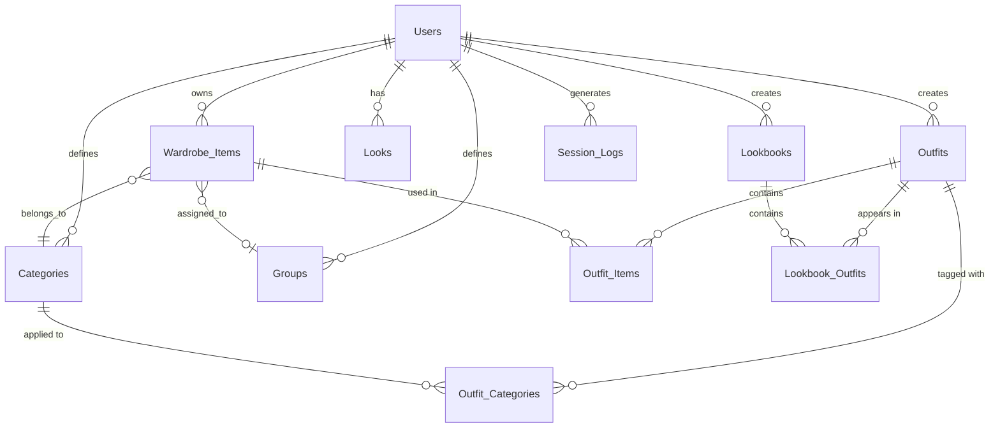

# Database Schema Documentation

This document outlines the database schema required for the Full Stylist application. The schema is designed to support user accounts, wardrobe management, outfit generation, and styling features.

## Overview

The database uses a relational structure with the following main entities:
- Users (authentication and preferences)
- Wardrobe Items (user's clothing collection)
- Outfits (generated mannequin and human-wearing outfits)
- Looks (headshots and body references)
- Categories and Groups (organization)
- Lookbooks (outfit collections)
- Session Logs (activity tracking)

## Tables

### users

Stores user account information and preferences.

| Column | Type | Constraints | Description |
|--------|------|-------------|-------------|
| id | UUID | PRIMARY KEY, NOT NULL | Unique user identifier |
| username | VARCHAR(100) | UNIQUE, NOT NULL | User's login name |
| password_hash | VARCHAR(255) | NOT NULL | Hashed password (bcrypt recommended) |
| created_at | TIMESTAMP | NOT NULL, DEFAULT NOW() | Account creation timestamp |
| updated_at | TIMESTAMP | NOT NULL, DEFAULT NOW() | Last update timestamp |
| preferences | JSONB | DEFAULT '{}' | User preferences (view settings, auto-tagging, weather settings) |

**Indexes:**
- `idx_users_username` on `username`

---

### wardrobe_items

Stores individual clothing items in user's wardrobe.

| Column | Type | Constraints | Description |
|--------|------|-------------|-------------|
| id | UUID | PRIMARY KEY, NOT NULL | Unique item identifier |
| user_id | UUID | FOREIGN KEY (users.id), NOT NULL | Owner of the item |
| image_url | TEXT | NOT NULL | URL to stored image (Cloudinary/Netlify Blobs) |
| original_image_url | TEXT | NULL | URL to original image (if background removed) |
| title | VARCHAR(200) | NOT NULL | Item name/title |
| size | VARCHAR(10) | DEFAULT 'M' | Item size (XS, S, M, L, XL, etc.) |
| category | VARCHAR(50) | NOT NULL, DEFAULT 'All' | Item category (Tops, Bottoms, etc.) |
| group_id | UUID | FOREIGN KEY (groups.id), NULL | User-defined group assignment |
| primary_color | VARCHAR(50) | NULL | Primary color name |
| color_data | JSONB | NULL | Color extraction data {r, g, b, h, s, l, hex} |
| style | VARCHAR(50) | DEFAULT 'casual' | Style descriptor |
| last_worn | DATE | NULL | Last date item was worn |
| favourite | BOOLEAN | DEFAULT FALSE | Favorite flag |
| created_at | TIMESTAMP | NOT NULL, DEFAULT NOW() | Item creation timestamp |
| updated_at | TIMESTAMP | NOT NULL, DEFAULT NOW() | Last update timestamp |

**Indexes:**
- `idx_wardrobe_user_id` on `user_id`
- `idx_wardrobe_category` on `category`
- `idx_wardrobe_group` on `group_id`
- `idx_wardrobe_created` on `created_at`

**Foreign Keys:**
- `user_id` REFERENCES `users(id)` ON DELETE CASCADE
- `group_id` REFERENCES `groups(id)` ON DELETE SET NULL

---

### outfits

Stores generated outfits (both mannequin and human-wearing versions).

| Column | Type | Constraints | Description |
|--------|------|-------------|-------------|
| id | UUID | PRIMARY KEY, NOT NULL | Unique outfit identifier |
| user_id | UUID | FOREIGN KEY (users.id), NOT NULL | Owner of the outfit |
| name | VARCHAR(200) | NOT NULL | Outfit name (AI-generated or user-defined) |
| mannequin_image_url | TEXT | NOT NULL | URL to mannequin version |
| human_image_url | TEXT | NULL | URL to human-wearing version (if generated) |
| last_worn | TIMESTAMP | NULL | When outfit was last "worn" (human version generated) |
| created_at | TIMESTAMP | NOT NULL, DEFAULT NOW() | Outfit creation timestamp |
| updated_at | TIMESTAMP | NOT NULL, DEFAULT NOW() | Last update timestamp |

**Indexes:**
- `idx_outfits_user_id` on `user_id`
- `idx_outfits_created` on `created_at`
- `idx_outfits_last_worn` on `last_worn`

**Foreign Keys:**
- `user_id` REFERENCES `users(id)` ON DELETE CASCADE

---

### outfit_items

Junction table linking outfits to wardrobe items used in generation.

| Column | Type | Constraints | Description |
|--------|------|-------------|-------------|
| outfit_id | UUID | FOREIGN KEY (outfits.id), NOT NULL | Outfit identifier |
| wardrobe_item_id | UUID | FOREIGN KEY (wardrobe_items.id), NOT NULL | Wardrobe item identifier |
| created_at | TIMESTAMP | NOT NULL, DEFAULT NOW() | Link creation timestamp |

**Primary Key:**
- Composite: `(outfit_id, wardrobe_item_id)`

**Indexes:**
- `idx_outfit_items_outfit` on `outfit_id`
- `idx_outfit_items_wardrobe` on `wardrobe_item_id`

**Foreign Keys:**
- `outfit_id` REFERENCES `outfits(id)` ON DELETE CASCADE
- `wardrobe_item_id` REFERENCES `wardrobe_items(id)` ON DELETE CASCADE

---

### looks

Stores user's headshot and body reference images.

| Column | Type | Constraints | Description |
|--------|------|-------------|-------------|
| id | UUID | PRIMARY KEY, NOT NULL | Unique look identifier |
| user_id | UUID | FOREIGN KEY (users.id), NOT NULL | Owner of the look |
| headshot_image_url | TEXT | NOT NULL | URL to headshot image |
| body_image_url | TEXT | NOT NULL | URL to body reference image |
| created_at | TIMESTAMP | NOT NULL, DEFAULT NOW() | Look creation timestamp |

**Indexes:**
- `idx_looks_user_id` on `user_id`
- `idx_looks_created` on `created_at`

**Foreign Keys:**
- `user_id` REFERENCES `users(id)` ON DELETE CASCADE

---

### categories

Stores clothing categories (both default and user-defined).

| Column | Type | Constraints | Description |
|--------|------|-------------|-------------|
| id | UUID | PRIMARY KEY, NOT NULL | Unique category identifier |
| user_id | UUID | FOREIGN KEY (users.id), NULL | NULL for default categories, user_id for custom |
| name | VARCHAR(50) | NOT NULL | Category name |
| is_custom | BOOLEAN | NOT NULL, DEFAULT FALSE | Whether category is user-defined |
| created_at | TIMESTAMP | NOT NULL, DEFAULT NOW() | Category creation timestamp |

**Indexes:**
- `idx_categories_user_id` on `user_id`
- `idx_categories_name` on `name`

**Foreign Keys:**
- `user_id` REFERENCES `users(id)` ON DELETE CASCADE

**Unique Constraints:**
- `(user_id, name)` - Users cannot have duplicate category names

---

### groups

Stores user-defined groups for organizing wardrobe items.

| Column | Type | Constraints | Description |
|--------|------|-------------|-------------|
| id | UUID | PRIMARY KEY, NOT NULL | Unique group identifier |
| user_id | UUID | FOREIGN KEY (users.id), NOT NULL | Owner of the group |
| name | VARCHAR(100) | NOT NULL | Group name |
| created_at | TIMESTAMP | NOT NULL, DEFAULT NOW() | Group creation timestamp |

**Indexes:**
- `idx_groups_user_id` on `user_id`

**Foreign Keys:**
- `user_id` REFERENCES `users(id)` ON DELETE CASCADE

**Unique Constraints:**
- `(user_id, name)` - Users cannot have duplicate group names

---

### lookbooks

Stores user-defined lookbook collections.

| Column | Type | Constraints | Description |
|--------|------|-------------|-------------|
| id | UUID | PRIMARY KEY, NOT NULL | Unique lookbook identifier |
| user_id | UUID | FOREIGN KEY (users.id), NOT NULL | Owner of the lookbook |
| name | VARCHAR(100) | NOT NULL | Lookbook name |
| cover_image_url | TEXT | NULL | URL to cover image (from an outfit) |
| created_at | TIMESTAMP | NOT NULL, DEFAULT NOW() | Lookbook creation timestamp |
| updated_at | TIMESTAMP | NOT NULL, DEFAULT NOW() | Last update timestamp |

**Indexes:**
- `idx_lookbooks_user_id` on `user_id`

**Foreign Keys:**
- `user_id` REFERENCES `users(id)` ON DELETE CASCADE

**Unique Constraints:**
- `(user_id, name)` - Users cannot have duplicate lookbook names

---

### lookbook_outfits

Junction table linking outfits to lookbooks.

| Column | Type | Constraints | Description |
|--------|------|-------------|-------------|
| lookbook_id | UUID | FOREIGN KEY (lookbooks.id), NOT NULL | Lookbook identifier |
| outfit_id | UUID | FOREIGN KEY (outfits.id), NOT NULL | Outfit identifier |
| created_at | TIMESTAMP | NOT NULL, DEFAULT NOW() | Link creation timestamp |

**Primary Key:**
- Composite: `(lookbook_id, outfit_id)`

**Indexes:**
- `idx_lookbook_outfits_lookbook` on `lookbook_id`
- `idx_lookbook_outfits_outfit` on `outfit_id`

**Foreign Keys:**
- `lookbook_id` REFERENCES `lookbooks(id)` ON DELETE CASCADE
- `outfit_id` REFERENCES `outfits(id)` ON DELETE CASCADE

---

### outfit_categories

Junction table for tagging outfits with multiple categories.

| Column | Type | Constraints | Description |
|--------|------|-------------|-------------|
| outfit_id | UUID | FOREIGN KEY (outfits.id), NOT NULL | Outfit identifier |
| category_id | UUID | FOREIGN KEY (categories.id), NOT NULL | Category identifier |
| created_at | TIMESTAMP | NOT NULL, DEFAULT NOW() | Tag creation timestamp |

**Primary Key:**
- Composite: `(outfit_id, category_id)`

**Indexes:**
- `idx_outfit_categories_outfit` on `outfit_id`
- `idx_outfit_categories_category` on `category_id`

**Foreign Keys:**
- `outfit_id` REFERENCES `outfits(id)` ON DELETE CASCADE
- `category_id` REFERENCES `categories(id)` ON DELETE CASCADE

---

### session_logs

Stores user activity logs for analytics and debugging.

| Column | Type | Constraints | Description |
|--------|------|-------------|-------------|
| id | UUID | PRIMARY KEY, NOT NULL | Unique log entry identifier |
| user_id | UUID | FOREIGN KEY (users.id), NOT NULL | User who performed the action |
| action_type | VARCHAR(50) | NOT NULL | Action type (login, generate_mannequin, wear_outfit, etc.) |
| details | JSONB | DEFAULT '{}' | Additional action details |
| timestamp | TIMESTAMP | NOT NULL, DEFAULT NOW() | When the action occurred |

**Indexes:**
- `idx_session_logs_user_id` on `user_id`
- `idx_session_logs_timestamp` on `timestamp`
- `idx_session_logs_action` on `action_type`

**Foreign Keys:**
- `user_id` REFERENCES `users(id)` ON DELETE CASCADE

---

## Entity Relationship Diagram



## Data Types

### UUID
- Used for all primary keys and foreign keys
- Ensures globally unique identifiers
- Recommended: Use PostgreSQL's `uuid_generate_v4()` or equivalent

### JSONB (PostgreSQL) / JSON (Other databases)
- Used for flexible data structures:
  - `users.preferences`: User settings and preferences
  - `wardrobe_items.color_data`: Color extraction results
  - `session_logs.details`: Variable action details

### TIMESTAMP
- All timestamps stored in UTC
- Use database's `NOW()` or equivalent for defaults
- Consider timezone handling in application layer

## Image Storage Strategy

### Recommended Approach
1. **Primary Storage**: Use a dedicated image hosting service
   - **Cloudinary**: Automatic optimization, transformations
   - **Netlify Blobs**: Integrated with Netlify deployment
   - **AWS S3 + CloudFront**: Scalable, CDN-enabled

2. **Image URLs**: Store full URLs in database
   - Format: `https://[service]/[user_id]/[image_id].[ext]`
   - Include version/transformation parameters if needed

3. **Image Processing**:
   - Background removal: Process on upload, store both versions
   - Thumbnails: Generate on upload, store separate URLs
   - Optimization: Compress and optimize on upload

4. **Migration from Base64**:
   - Export all base64 images from LocalStorage
   - Upload to image service
   - Update database with new URLs
   - Implement migration script

## Authentication & Authorization

### Password Hashing
- Use bcrypt with cost factor 10-12
- Never store plaintext passwords
- Implement password reset flow with secure tokens

### User Sessions
- Implement JWT tokens or session-based authentication
- Store session tokens securely (httpOnly cookies recommended)
- Include user_id in all queries for data isolation

### Data Isolation
- All queries must filter by `user_id`
- Use row-level security (RLS) if supported by database
- Never return data from other users

## Example Queries

### Get user's wardrobe items with categories
```sql
SELECT wi.*, c.name as category_name, g.name as group_name
FROM wardrobe_items wi
LEFT JOIN categories c ON wi.category = c.name AND (c.user_id = wi.user_id OR c.user_id IS NULL)
LEFT JOIN groups g ON wi.group_id = g.id
WHERE wi.user_id = $1
ORDER BY wi.created_at DESC;
```

### Get outfits with item breakdown
```sql
SELECT o.*, 
       json_agg(json_build_object('id', wi.id, 'title', wi.title, 'image_url', wi.image_url)) as items
FROM outfits o
LEFT JOIN outfit_items oi ON o.id = oi.outfit_id
LEFT JOIN wardrobe_items wi ON oi.wardrobe_item_id = wi.id
WHERE o.user_id = $1
GROUP BY o.id
ORDER BY o.created_at DESC;
```

### Get lookbook with outfit count
```sql
SELECT lb.*, 
       COUNT(lo.outfit_id) as outfit_count,
       json_agg(DISTINCT o.id) as outfit_ids
FROM lookbooks lb
LEFT JOIN lookbook_outfits lo ON lb.id = lo.lookbook_id
LEFT JOIN outfits o ON lo.outfit_id = o.id
WHERE lb.user_id = $1
GROUP BY lb.id;
```

### Get calendar data for a month
```sql
SELECT DATE(o.last_worn) as date,
       json_agg(json_build_object('id', o.id, 'name', o.name, 'image_url', o.human_image_url)) as outfits
FROM outfits o
WHERE o.user_id = $1
  AND o.last_worn IS NOT NULL
  AND EXTRACT(MONTH FROM o.last_worn) = $2
  AND EXTRACT(YEAR FROM o.last_worn) = $3
GROUP BY DATE(o.last_worn)
ORDER BY date;
```

## Migration Notes

### Initial Setup
1. Create all tables in order (respecting foreign key dependencies)
2. Insert default categories (Tops, Bottoms, Shoes, Accessories, Outerwear, Dresses)
3. Set up indexes after table creation for better performance

### Future Schema Changes
- Use migration scripts for schema updates
- Version control all schema changes
- Test migrations on staging before production
- Consider backward compatibility for API changes

## Performance Considerations

### Indexing Strategy
- Index all foreign keys
- Index frequently queried columns (user_id, category, created_at)
- Consider composite indexes for common query patterns
- Monitor query performance and adjust indexes as needed

### Query Optimization
- Use pagination for large result sets
- Implement caching for frequently accessed data
- Consider materialized views for complex aggregations
- Use connection pooling

### Image Optimization
- Store multiple image sizes (thumbnail, medium, full)
- Implement lazy loading
- Use CDN for image delivery
- Compress images on upload

## Security Considerations

### SQL Injection Prevention
- Use parameterized queries exclusively
- Never concatenate user input into SQL
- Validate all input data

### Data Validation
- Validate image URLs before storage
- Sanitize user-generated content (titles, names)
- Enforce length limits on text fields
- Validate UUIDs before use in queries

### Access Control
- Implement row-level security policies
- Verify user ownership before any data modification
- Log all data access for audit trails

## Recommended Database

### PostgreSQL
- Excellent JSONB support for flexible data
- Strong foreign key constraints
- Row-level security (RLS) support
- Excellent performance and scalability
- Full-text search capabilities

### Alternative Options
- **Supabase**: PostgreSQL with built-in auth and storage
- **Firebase/Firestore**: NoSQL, good for rapid development
- **MySQL/MariaDB**: Traditional option, good JSON support

## Next Steps

1. Set up database instance (PostgreSQL recommended)
2. Run schema creation scripts
3. Implement authentication system
4. Create API endpoints for data access
5. Migrate LocalStorage data to database
6. Implement image upload to storage service
7. Set up backup and recovery procedures
